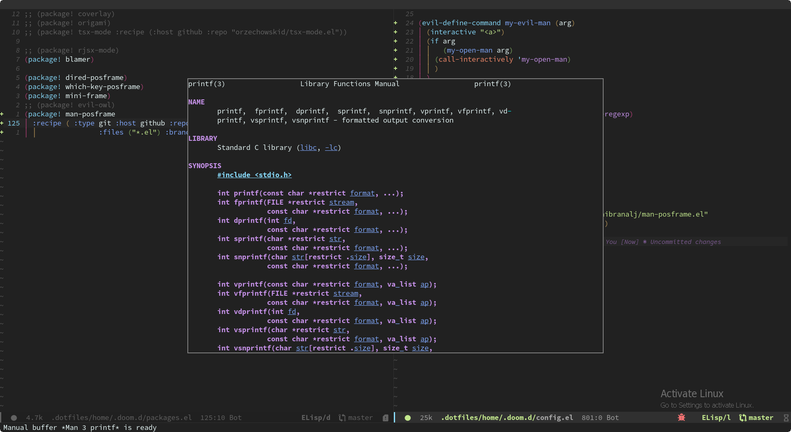

# man-posframe.el 
View man pages on a popup frame using posframe



## Usage
```elisp
(call-interactively 'man-posframe-show)
;; or
(man-posframe-show "3 printf")
```

## Installation
### Using straight
```elisp
(use-package man-posframe
  :straight (:type git :host github :repo "Ghibranalj/man-posframe.el"
             :files ("*.el") :branch "master")
  :ensure t
  :custom
  (man-posframe-width  100)
  (man-posframe-height  30))
```
### Doom emacs
in `packages.el`
```elisp
(package! man-posframe
  :recipe ( :type git :host github :repo "Ghibranalj/man-posframe.el"
                  :files ("*.el") :branch "master"))
```
in `config.el`
```elisp
(use-package! man-posframe
  :custom
  (man-posframe-width  100)
  (man-posframe-height  30))

```

## default keymap
```elisp
(define-key map (kbd "q") 'man-posframe-close)
(define-key map (kbd "j") 'man-posframe-scroll-down)
(define-key map (kbd "k") 'man-posframe-scroll-up)
(define-key map (kbd "<escape>") 'man-posframe-close)
```
